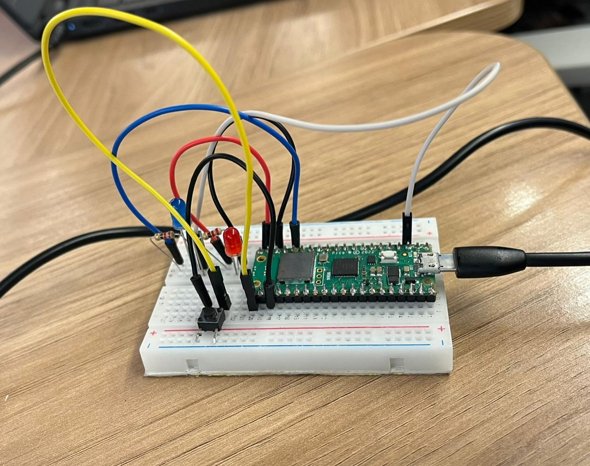

# **Jogo Pygame**

O `pc_game.py` é o programa que escrevi para rodar no PC com `pygame`. Ele faz a interface gráfica, move o alvo, gera projéteis quando recebo `FIRE` do Pico e comunica resultados de volta para o Pico (`HIT <score>` ou `MISS <score>`).

## Arquivos
- `pc_game.py`: o jogo que abre uma janela, desenha o alvo, o personagem e os projéteis, e comunica com o Pico via `pyserial`.

## Como eu executo o jogo (no Windows / PowerShell)

1. Ativo o ambiente virtual do projeto:
```powershell
cd C:\Users\KaylanedeBrito\Documents\GitHub\TiroAoAlvo
.\venv\Scripts\Activate.ps1
cd pc_game
```
2. Consulto a porta COM do Pico e depois rodo:
```powershell
python pc_game.py COM4
```

Controles e comportamento
- `SPACE`: simula um tiro local (útil para testar sem Pico conectado).
- Botão no Pico (GP16): quando pressionado o Pico envia `FIRE` e o jogo cria um projétil.
- `ESC` ou fechar a janela: fecha o jogo.

## Como o tiro funciona (o raciocínio que implementei)

Inicialmente eu fazia a checagem de acerto imediatamente quando recebia `FIRE`. Percebi que isso fazia o tiro ser instantâneo e sem animação — além de que, na primeira versão, ao apertar o botão o projétil não aparecia (apenas `SPACE` funcionava). Para deixar a jogabilidade melhor eu alterei o código para:

- Criar um projétil na posição do personagem quando chega `FIRE`.
- Atualizar o projétil a cada frame (ele sobe) e verificar colisão com o alvo somente quando o projétil alcança a área do alvo.
- Enviar `HIT <score>` ao Pico apenas quando o projétil atinge o alvo; enviar `MISS <score>` quando o projétil sai da tela.

## Desafios e como eu contornei

- Montagem e porta serial: no começo o Thonny estava com a porta COM ocupada, então o `pc_game.py` não conseguia abrir a mesma porta; fechei o Thonny antes de rodar o jogo.
- Colisão instantânea: mudei para projéteis animados (spawn + movimento + colisão) porque isso deixa o jogo mais intuitivo e facilitou debugar se o Pico e o PC estavam trocando mensagens corretamente.

## Dicas de debug que usei

- Para listar portas COM:
```powershell
python -m serial.tools.list_ports
```
- Se o jogo disser que não consegue abrir a porta, verifique se o Thonny está aberto; feche o REPL do Thonny.
- Use `SPACE` para testar sem hardware; quando o `SPACE` funciona mas o botão não, verifique wiring no Pico e o `pico/main.py` conforme expliquei no `pico/README.md`.

# **Código do Pico**

O `main.py` que coloquei no Raspberry Pi Pico W faz o seguinte:
- Monitora um botão conectado ao pino GP16; quando o botão é pressionado, o Pico envia a string `FIRE` pela porta serial USB ao PC.
- Recebe mensagens do PC no formato `HIT <score>` ou `MISS <score>` e pisca LEDs: azul quando eu acerto e vermelho quando erro.

## Como carreguei o código no Pico:

1. Abri o Thonny e selecionei o interpretador "MicroPython (Raspberry Pi Pico)".
2. Carreguei `pico/main.py` pelo Thonny (File → Save as... → dispositivo Raspberry Pi Pico → `main.py`).
3. Reiniciei o Pico e verifiquei o console.

Pinos que usei (em `main.py`)
- Botão: **GP16** — o botão deve ligar GP16 ao GND quando pressionado; no código usei `Pin.PULL_UP`.
- LED vermelho (MISS): **GP15** — pisca quando o PC responde `MISS`.
- LED azul (HIT): **GP12** — pisca quando o PC responde `HIT`.

## Desafios e como eu contornei

- Montagem da protoboard: no começo tive dificuldade para posicionar o Pico e os componentes; pedi ajuda para a minha amiga Rafaella Rojas para confirmar ligações e a posição correta do botão na protoboard, ela me deu suporte e consegui finalizar o protótipo.
- Botão não funcionava inicialmente: ao testar, o comportamento era que somente a tecla `SPACE` no PC disparava o tiro — o botão físico não. Descobri que eu havia usado `PULL_DOWN` na primeira versão (e meu botão estava ligado ao GND), então mudei para `Pin.PULL_UP` e passei a detectar a transição de 1→0 (queda). Com essa mudança o botão físico começou a funcionar corretamente.
- Debug serial: percebi que o Thonny prende a porta COM; para que o jogo (PC) leia o Pico eu precisei fechar o REPL do Thonny antes de rodar `pc_game.py`.

## Observações finais

O código do Pico só roda no dispositivo com MicroPython. Para ver o sistema funcionando, é necessário rodar o jogo no PC (`pc_game/pc_game.py`) e garantir que o Thonny não esteja usando a porta serial.

# **Protótipo**

